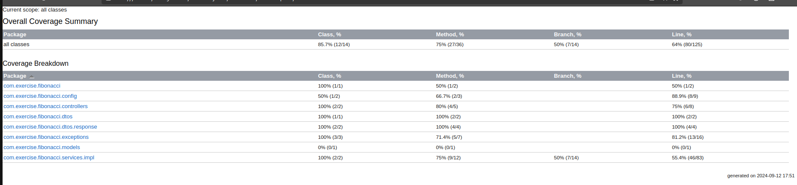

# Fibonacci RestAPI #

## Resumen ##

Esta es un rest api que proporciona el numero fibonacci de un numero dado, también puede suministrar la estadísticas de consultas de los números consultado y la ocurrencia de la búsqueda.

## Stack tecnológico ##
- Java 17
- Spring Boot
- Spring Data JPA
- PostgresSQL
- Swagger

## Funcionalidades ##
La rest API cuenta con los siguientes endpoint:
- Calculo de numero Fibonacci: es el endpoint de la funcion principal el cual generara con resultado el numero fibonacci del numero consultado.

```
/api/v1/fib/{number}
```

- Estadísticas: en los endpoint que a continuación se muestran puede consultar el numero de veces que un numero fue consultado y tambien dado un dia cuantas consulta se realizaron:
- Estadísticas por numero especifico:
``` 
/api/v1/statistic/{number} 
```
- Estadísticas dada una fecha en adelante:
```
/api/v1/statistic/by-date/{date}
```

Para mas información dejo el link al swagger del proyecto:

`fibonacci-production-36db.up.railway.app/swagger-ui/index.html`

## Deploy ##

Tanto el proyecto como la base de datos esta deployado el siguiente direccion

```
fibonacci-production-36db.up.railway.app
```

este es un servicio en la nube llamado railway.

## Convertura alcanza ##

